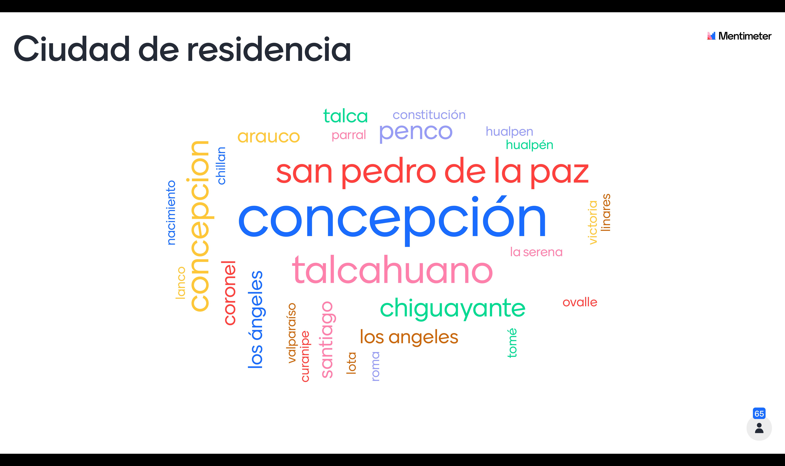
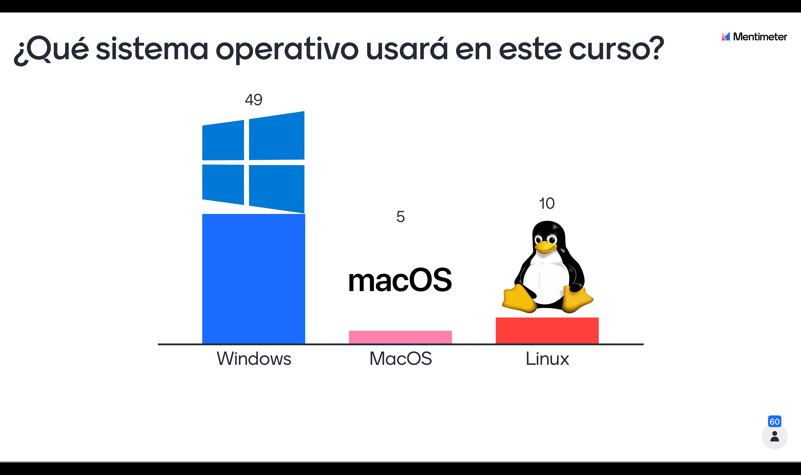
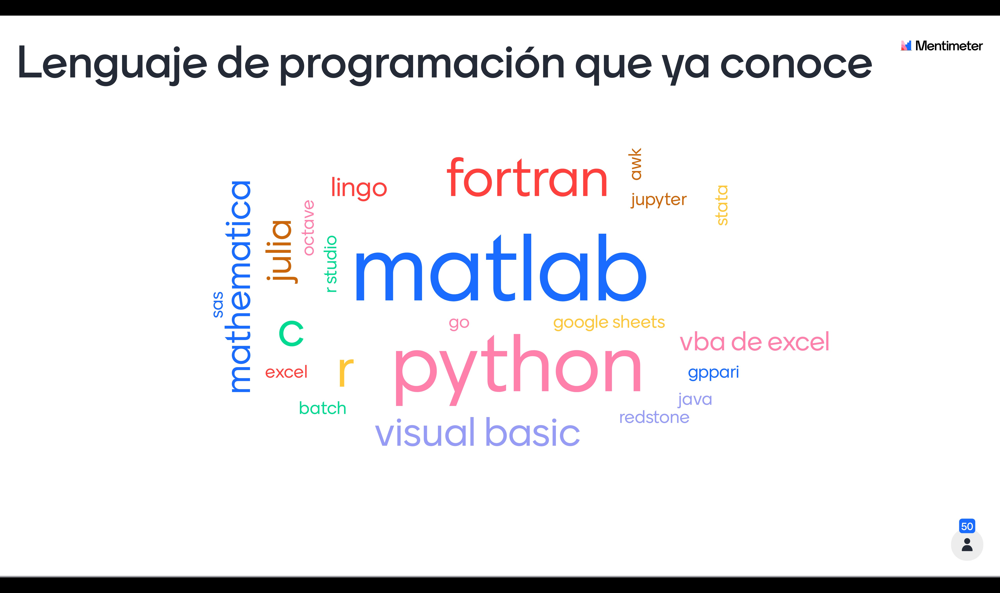
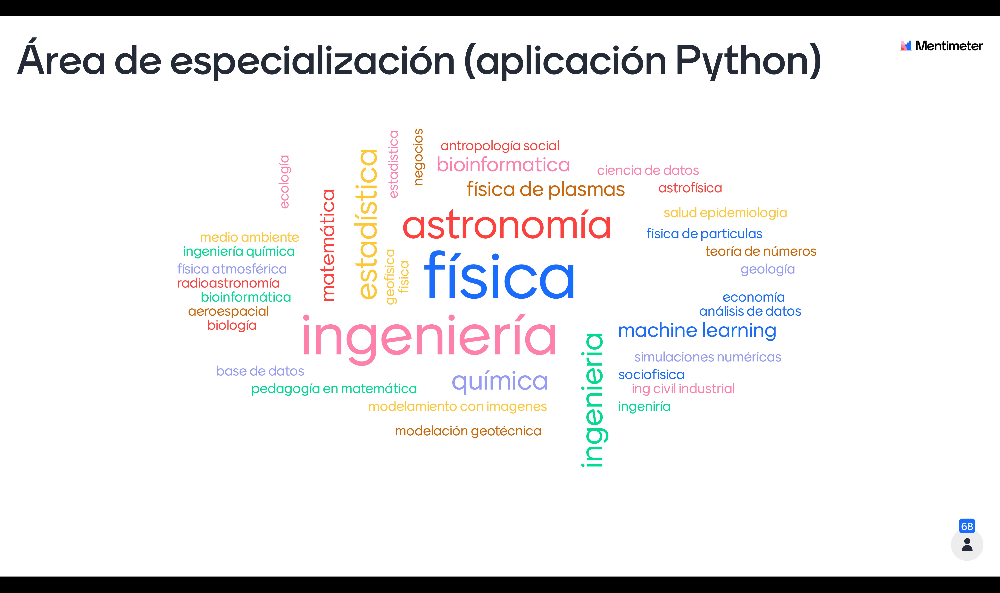

* [Video sesión de la mañana](https://us02web.zoom.us/rec/share/51aF-4fzjKq4NOlDIunKr_JbO6beql-D4jQ-lvZHsqaocJUI9hFOBpJ3cX6lZSCz.fET_oaBD25eITqmX)
* [Archivo pdf de la presentación](./Python-Intro-2021.pdf).
* Resultados de encuestas realizada en la Bienvenida + Introducción:

